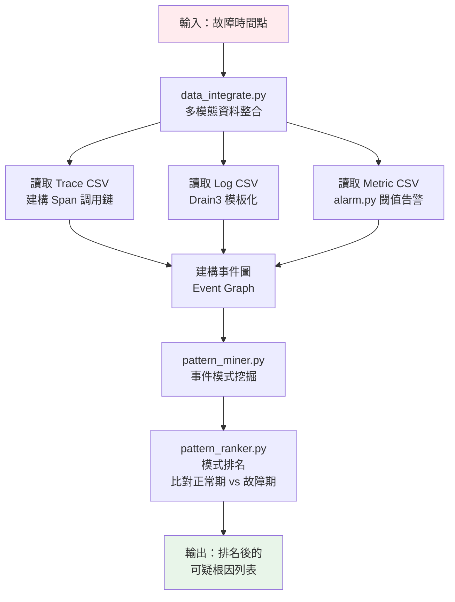
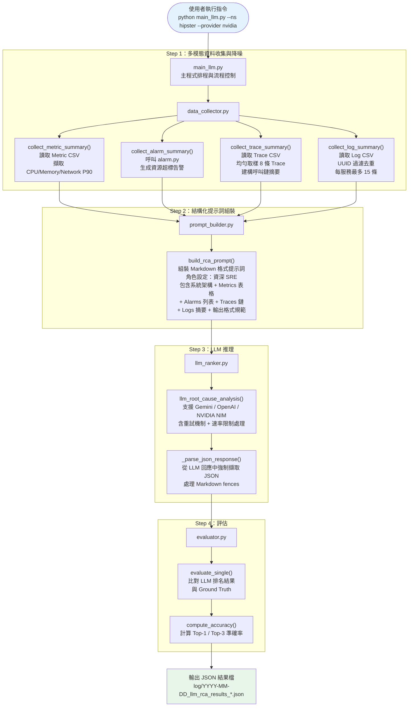
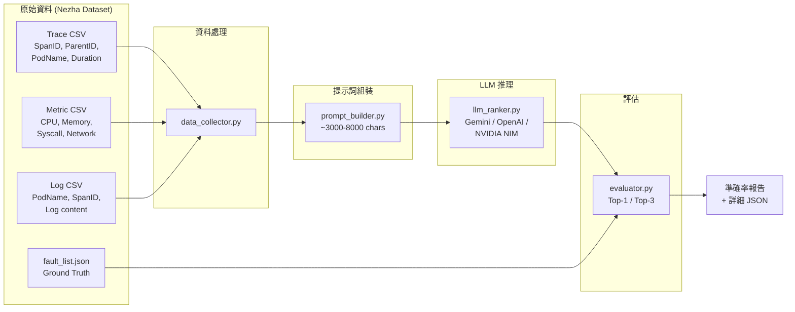
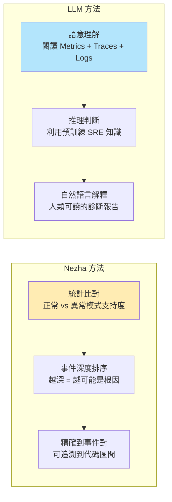

# 基於大型語言模型的微服務根因分析系統

## ——以 Nezha 框架為基礎的 LLM-based RCA 改造實驗

---

## 目錄

1. [研究背景與動機](#1-研究背景與動機)
2. [問題定義](#2-問題定義)
3. [相關工作：原始 Nezha 系統](#3-相關工作原始-nezha-系統)
4. [提出方法：LLM-based RCA](#4-提出方法llm-based-rca)
5. [系統架構與實作](#5-系統架構與實作)
6. [實驗設計](#6-實驗設計)
7. [實驗結果](#7-實驗結果)
8. [分析與討論](#8-分析與討論)
9. [結論與未來工作](#9-結論與未來工作)

---

## 1. 研究背景與動機

### 1.1 微服務架構的挑戰

現代雲端原生應用程式普遍採用**微服務架構**，將單一龐大應用拆分為數十甚至上百個獨立部署的小型服務。以 Google 開源的 **OnlineBoutique** 電商範例為例，一個購物網站就包含了 frontend、cartservice、currencyservice、productcatalogservice、checkoutservice 等 10 個以上的微服務。

這種架構帶來了靈活性和可擴展性，但同時也引入了新的運維難題：

- **故障傳播鏈複雜**：一個服務的異常會沿著調用鏈逐層擴散，導致多個服務同時出現異常指標
- **可觀測性資料龐大**：每分鐘都會產生數以萬計的 Traces、Logs 和 Metrics 資料
- **根因定位困難**：運維工程師（SRE）需要從海量資料中判斷「真正的根因」和「因果傳播的表象」之間的差異

### 1.2 研究動機

傳統的根因分析方法（如 Nezha）透過**事件圖挖掘與統計模式比對**來定位根因，雖然準確率高，但存在以下限制：

1. **流程複雜**：需要多個步驟的資料轉換（原始資料 → 事件圖 → 模式挖掘 → 模式排名）
2. **可解釋性有限**：輸出的是事件對（event pair）的分數排名，非人類直覺可讀的診斷報告
3. **依賴領域知識**：需要手動定義 log template、metric threshold、alarm 規則等

> [!IMPORTANT]
> 核心問題：**能否用大型語言模型（LLM）直接「閱讀」原始的 profiling data，像一位經驗豐富的 SRE 工程師一樣，直接給出根因分析結果？**

這就是本研究的出發點。

---

## 2. 問題定義

### 2.1 研究問題

**RQ：大型語言模型是否能根據微服務的 profiling data（Traces、Logs、Metrics）提出合理的根因分析結果？**

具體而言，我們探討以下子問題：

| 子問題 | 內容 |
|--------|------|
| RQ1 | LLM 能否正確識別出故障服務（service-level RCA）？ |
| RQ2 | 不同 LLM 模型的根因分析能力有何差異？ |
| RQ3 | LLM 方法與傳統事件圖挖掘方法（Nezha）的表現差距有多大？ |

### 2.2 任務定義

給定一個故障時間點 $t$ 的多模態可觀測性資料（Traces、Logs、Metrics），系統需要：

1. 識別最可能的**故障根因服務**（Top-1, Top-3）
2. 判斷**故障類型**（cpu_contention, network_delay, memory, exception, return）
3. 提供**推理依據**（evidence）

### 2.3 評估指標

- **Top-1 Accuracy (AS@1)**：根因服務排在 LLM 輸出的第 1 名的比例
- **Top-3 Accuracy (AS@3)**：根因服務出現在 LLM 輸出的前 3 名中的比例

---

## 3. 相關工作：原始 Nezha 系統

### 3.1 論文來源

Nezha 是發表於 **ESEC/FSE 2023**（軟體工程頂級會議）的根因分析框架：

> Yu et al., *"Nezha: Interpretable Fine-Grained Root Causes Analysis for Microservices on Multi-Modal Observability Data"*, ESEC/FSE 2023

### 3.2 核心思想

Nezha 的核心理念是**「比較正常期與故障期的事件模式差異來定位根因」**。它將異質的多模態資料（Traces、Logs、Metrics）統一轉化為同質的**事件圖（Event Graph）**表示，再通過圖挖掘技術提取事件模式（Event Pattern），最後比較正常期與故障期的模式支持度差異來排名可疑根因。

### 3.3 原始架構流程



### 3.4 關鍵模組說明

| 模組 | 檔案 | 功能 |
|------|------|------|
| 資料整合 | [data_integrate.py](file:///d:/Nezha/Nezha/data_integrate.py) | 將 Trace、Log、Metric 三種資料整合為事件圖 |
| 日誌解析 | [log_parsing.py](file:///d:/Nezha/Nezha/log_parsing.py) | 使用 Drain3 演算法將原始日誌模板化為事件 ID |
| 告警生成 | [alarm.py](file:///d:/Nezha/Nezha/alarm.py) | 根據預計算的閾值（mean ± 3σ）判斷 Metric 是否異常 |
| 模式挖掘 | [pattern_miner.py](file:///d:/Nezha/Nezha/pattern_miner.py) | 從事件圖中提取頻繁事件對及其支持度 |
| 模式排名 | [pattern_ranker.py](file:///d:/Nezha/Nezha/pattern_ranker.py) | 計算異常分數並排名可疑根因 |
| 主程式 | [main.py](file:///d:/Nezha/Nezha/main.py) | 串接完整流程的入口程式 |

### 3.5 原始系統結果（OnlineBoutique）

根據 README 文件記錄，原始 Nezha 系統在 OnlineBoutique 數據集上的表現：

| 指標 | 結果 |
|------|------|
| **AS@1** | **92.86%** |
| **AS@3** | **96.43%** |
| AS@5 | 96.43% |
| 故障案例總數 | 56 |

---

## 4. 提出方法：LLM-based RCA

### 4.1 核心理念

我們提出一個**全新的方法論**：用 LLM 取代原始 Nezha 中所有的圖形演算法和統計模型。

> [!TIP]
> 設計哲學：**「與其讓機器用數學公式比對模式，不如讓 AI 像人類 SRE 一樣閱讀監控數據」**

具體而言，我們：
1. **保留**原始系統的資料收集能力（讀取 Trace、Log、Metric CSV 檔）
2. **捨棄**事件圖構建 → 模式挖掘 → 模式排名的整條統計分析鏈
3. **新增**資料摘要 → 提示詞組裝 → LLM 推理的新鏈路

### 4.2 方法對比

| 面向 | 原始 Nezha | LLM-based RCA（本研究） |
|------|-----------|----------------------|
| 資料表示 | 事件圖（Event Graph） | 人類可讀的文字摘要 |
| 分析引擎 | 頻繁子圖挖掘 + 異常分數計算 | LLM 語意推理 |
| 輸出格式 | 事件對排名分數 | JSON（service + fault_type + evidence） |
| 可解釋性 | 低（需要理解事件 ID 對應） | 高（自然語言解釋） |
| 需要的領域知識 | 多（需要 Drain3 模板、閾值計算） | 少（LLM 利用預訓練知識） |
| 需要正常基準線 | **必須**（用於計算模式差異） | **可選**（有/無基準線皆可運作） |

### 4.3 LLM 版架構流程



---

## 5. 系統架構與實作

### 5.1 我們新增的五個核心檔案

#### 5.1.1 [main_llm.py](file:///d:/Nezha/Nezha/main_llm.py) — 主程式排程與流程控制

**功能**：整個 LLM-based RCA 的入口程式，負責：
- 解析命令列參數（namespace、provider、model、delay 等）
- 讀取故障注入清單（fault_list.json）
- 計算每個故障案例的異常觀測時間（故障注入時間 + 2 分鐘）
- 串接 data_collector → prompt_builder → llm_ranker → evaluator 的完整流水線
- 將所有結果寫入 JSON 檔案

**關鍵邏輯**：
```python
for fault in fault_inject_data[hour_key]:
    # 1. 收集 profiling data
    profiling_data = collect_profiling_data(abnormal_time, ns, rca_data_path)
    # 2. 建構 prompt
    prompt = build_rca_prompt(profiling_data)
    # 3. 呼叫 LLM
    llm_results = llm_root_cause_analysis(prompt, provider=provider)
    # 4. 評估
    rank = evaluate_single(llm_results, fault)
```

---

#### 5.1.2 [data_collector.py](file:///d:/Nezha/Nezha/data_collector.py) — 資料收集與降噪

**功能**：從 Nezha 的原始 CSV 資料檔中讀取多模態觀測資料，並進行**降噪處理**以適配 LLM 的 Token 限制。

**四大收集函數**：

| 函數 | 資料來源 | 降噪策略 |
|------|---------|---------|
| `collect_metric_summary()` | Metric CSV | 只擷取 CPU、Memory、Network P90 三個關鍵指標 |
| `collect_alarm_summary()` | Metric CSV + alarm.py | 沿用 Nezha 的閾值告警機制 |
| `collect_trace_summary()` | Trace CSV + TraceID CSV | 均勻取樣 8 條 Trace（而非全部），壓縮為文字呼叫鏈 |
| `collect_log_summary()` | Log CSV | UUID/TraceID 過濾去重，每服務最多保留 15 條 unique 訊息 |

**關鍵技術——日誌去重**：

原始日誌中包含大量 TraceID、SpanID 等動態 ID，導致相似訊息無法去重。我們通過 `_strip_dynamic_ids()` 函數進行正則替換：

```python
def _strip_dynamic_ids(message):
    msg = re.sub(r'TraceID:\s*[a-f0-9]+\s*', '', message)          # 移除 TraceID
    msg = re.sub(r'SpanID:\s*[a-f0-9]+\s*', '', msg)               # 移除 SpanID
    msg = re.sub(r'[a-f0-9]{8}-...-[a-f0-9]{12}', '<UUID>', msg)   # UUID → <UUID>
    msg = re.sub(r'userId=[^\s,]+', 'userId=<ID>', msg)             # 用戶ID匿名化
    return msg.strip()
```

---

#### 5.1.3 [prompt_builder.py](file:///d:/Nezha/Nezha/prompt_builder.py) — 提示詞工程

**功能**：將收集到的結構化資料組裝為一個結構化的 Markdown 提示詞。

**提示詞結構**：

```
┌─────────────────────────────────────────┐
│  角色設定                                │
│  "You are an experienced SRE..."         │
├─────────────────────────────────────────┤
│  § System Architecture                   │
│  → 服務列表                              │
├─────────────────────────────────────────┤
│  § Resource Metrics（Markdown 表格）      │
│  → CPU / Memory / Network P90 per pod    │
├─────────────────────────────────────────┤
│  § Resource Alarms                       │
│  → 哪些 pod 超過閾值                     │
├─────────────────────────────────────────┤
│  § Request Traces                        │
│  → 8 條取樣的呼叫鏈 + 每段延遲            │
├─────────────────────────────────────────┤
│  § Log Summary                           │
│  → 每服務去重後的關鍵日誌                  │
├─────────────────────────────────────────┤
│  § Task + Output Format                  │
│  → 要求回覆 JSON，包含 Top-3 根因         │
│  → 每個根因含 service / fault_type /      │
│    evidence                              │
└─────────────────────────────────────────┘
```

**兩種模式**：
1. **`build_rca_prompt()`**：僅提供故障期資料
2. **`build_rca_prompt_with_normal()`**：同時提供正常基準線 + 故障期資料供 LLM 對比

---

#### 5.1.4 [llm_ranker.py](file:///d:/Nezha/Nezha/llm_ranker.py) — LLM API 呼叫層

**功能**：封裝多個 LLM 提供商的 API 呼叫，統一介面。

**支援的提供商**：

| Provider | 呼叫函數 | 預設模型 | API 端點 |
|----------|---------|---------|---------|
| Gemini | `_call_gemini()` | gemini-2.0-flash | Google GenAI |
| OpenAI | `_call_openai()` | gpt-4o | OpenAI API |
| NVIDIA NIM | `_call_nvidia()` | meta/llama-3.3-70b-instruct | integrate.api.nvidia.com/v1 |

**關鍵防護機制**：
- **重試機制**：最多重試 5 次，指數退避
- **速率限制處理**：自動解析 429 錯誤中的建議等待時間
- **JSON 強制擷取**：`_parse_json_response()` 支援 3 種解析策略（直接 JSON → Markdown fence 提取 → 正則 `{...}` 擷取）

---

#### 5.1.5 [evaluator.py](file:///d:/Nezha/Nezha/evaluator.py) — 評估模組

**功能**：將 LLM 的輸出結果與 Ground Truth 對比。

**評估邏輯**：
1. 從 Ground Truth 的 `inject_pod` 中提取服務名（去除 Pod 後綴的 hash）
2. 遍歷 LLM 輸出的 Top-3 排名
3. 比對服務名是否匹配，記錄命中排名（1/2/3 或 -1 表示未命中）

```python
def evaluate_single(llm_results, ground_truth_fault):
    gt_service = _extract_service_name(ground_truth_fault["inject_pod"])
    for i, result in enumerate(llm_results):
        if result["service"].lower() == gt_service:
            return i + 1  # 返回排名（1-based）
    return -1  # 未命中
```

---

### 5.2 資料流程全貌



---

## 6. 實驗設計

### 6.1 資料集

本實驗使用 Nezha 論文所提供的公開資料集：

| 資料集 | 系統 | 日期 | 故障數量 |
|--------|------|------|---------|
| OnlineBoutique Day 1 | [2022-08-22](file:///d:/Nezha/Nezha/rca_data/2022-08-22) | 2022-08-22 | 24 |
| OnlineBoutique Day 2 | [2022-08-23](file:///d:/Nezha/Nezha/rca_data/2022-08-23) | 2022-08-23 | 32 |
| **合計** | | | **56** |

### 6.2 故障類型分佈

資料集包含 5 種故障注入類型，涵蓋 10 個微服務：

| 故障類型 | 說明 | 注入方式 |
|---------|------|---------|
| `cpu_contention` | CPU 資源爭奪 | stress-ng CPU 壓力 |
| `cpu_consumed` | CPU 過度消耗 | CPU 密集型任務 |
| `network_delay` | 網路延遲 | tc netem 注入延遲 |
| `exception` | 應用程式異常 | 注入異常拋出 |
| `return` | 邏輯錯誤（不正確的回傳值） | 修改回傳值 |

**涵蓋的微服務**：frontend, cartservice, checkoutservice, currencyservice, emailservice, paymentservice, productcatalogservice, recommendationservice, shippingservice, adservice

### 6.3 測試模型

我們選用了 3 個不同提供商的模型進行對比實驗：

| 模型 | 提供商 | 參數量 | 是否附正常基準線 |
|------|--------|--------|--------------|
| Gemini 2.0 Flash | Google (Gemini API) | 未公開 | ❌ 否 |
| Llama 3.3 70B Instruct | NVIDIA NIM (Meta) | 70B | ✅ 是 |
| Minimax M2.7 | NVIDIA NIM (Minimax) | 未公開 | ❌ 否 |

### 6.4 執行方式

```bash
# Gemini 2.0 Flash（無正常基準線）
python main_llm.py --ns hipster --provider gemini

# Llama 3.3 70B（含正常基準線對比）
python main_llm.py --ns hipster --provider nvidia --compare-normal

# Minimax M2.7（無正常基準線）
python main_llm.py --ns hipster --provider nvidia --model minimaxai/minimax-m2.7
```

---

## 7. 實驗結果

### 7.1 整體準確率對比

| 方法 | 模型 | 正常基準線 | Top-1 (AS@1) | Top-3 (AS@3) | 未找到 |
|------|------|-----------|-------------|-------------|--------|
| **原始 Nezha**（事件圖挖掘） | N/A | ✅ 必要 | **92.86%** | **96.43%** | 0 |
| LLM（Llama 3.3 70B） | meta/llama-3.3-70b | ✅ 有 | **73.21%** | **85.71%** | 8 |
| LLM（Minimax M2.7） | minimaxai/minimax-m2.7 | ❌ 無 | **55.36%** | **73.21%** | 15 |
| LLM（Gemini 2.0 Flash） | gemini-2.0-flash | ❌ 無 | **16.07%** | **19.64%** | 45 |

### 7.2 結果視覺化

```mermaid
xychart-beta
    title "各方法 Top-1 與 Top-3 準確率對比"
    x-axis ["Nezha (Original)", "Llama 3.3 70B\n(w/ baseline)", "Minimax M2.7\n(w/o baseline)", "Gemini 2.0 Flash\n(w/o baseline)"]
    y-axis "Accuracy (%)" 0 --> 100
    bar [92.86, 73.21, 55.36, 16.07]
    bar [96.43, 85.71, 73.21, 19.64]
```



### 7.3 詳細數據

| 指標 | Nezha | Llama 3.3 70B | Minimax M2.7 | Gemini 2.0 Flash |
|------|-------|---------------|-------------|-----------------|
| 總故障數 | 56 | 56 | 56 | 56 |
| Top-1 命中 | 52 | 41 | 31 | 9 |
| Top-3 命中 | 54 | 48 | 41 | 11 |
| 未找到 | 0 | 8 | 15 | 45 |
| Top-1 % | 92.86% | 73.21% | 55.36% | 16.07% |
| Top-3 % | 96.43% | 85.71% | 73.21% | 19.64% |

### 7.4 LLM 輸出範例

以下是 Minimax M2.7 對於 **cartservice network_delay** 故障的分析結果（Fault #5，命中 Top-1）：

```json
{
  "root_causes": [
    {
      "rank": 1,
      "service": "cartservice",
      "fault_type": "network_delay",
      "evidence": "cartservice NetworkP90=252.6ms exceeds threshold, and GetCart operations 
                   consistently show 240-260ms latency across all 8 traces. This is the 
                   dominant latency contributor in the call chains, with 
                   frontend→CartService/GetCart taking 240-259ms out of total trace 
                   durations of 313-502ms."
    },
    {
      "rank": 2,
      "service": "adservice",
      "fault_type": "memory",
      "evidence": "adservice MemoryUsageRate=81.38% exceeds threshold..."
    },
    {
      "rank": 3,
      "service": "currencyservice",
      "fault_type": "cpu_contention",
      "evidence": "currencyservice CPU=44.97% is elevated..."
    }
  ]
}
```

> [!NOTE]
> LLM 不僅正確識別了根因服務 (cartservice) 和故障類型 (network_delay)，還提供了詳細的推理證據，包括具體的延遲數值、跨 Trace 的一致性觀察，以及對整體呼叫鏈延遲佔比的分析。這種可解釋性是原始 Nezha 系統難以提供的。

---

## 8. 分析與討論

### 8.1 為什麼 Llama 3.3 70B 表現最好？

1. **模型規模**：70B 參數量提供了足夠的推理能力
2. **正常基準線對比**：提供了正常期資料讓模型進行差異分析，這與 Nezha 原始方法的「模式比較」思路一致
3. **指令遵循能力**：Llama 3.3 在結構化 JSON 輸出方面表現穩定

### 8.2 為什麼 Gemini 2.0 Flash 表現最差？

1. **未命中率極高**（45/56 = 80%）：大量案例中 LLM 完全未能找到正確服務
2. **缺乏正常基準線**：沒有對比資料，模型難以區分「固有的背景雜訊」與「真正的故障訊號」
3. **免費版本限制**：配額限制可能導致實驗中出現中斷

### 8.3 LLM 方法的共同弱點

通過分析所有 LLM 模型的失敗案例，我們發現以下共同弱點：

| 弱點類型 | 說明 | 範例 |
|---------|------|------|
| **「噪聲干擾」** | adservice 的 Memory 81% 幾乎在所有案例中都會告警，LLM 容易被其吸引 | 模型在 15 個未命中案例中有 8 個將 adservice 排在第 1 名 |
| **「無法偵測 return/exception」** | 邏輯錯誤不會反映在 Metrics 上，LLM 無法從數值異常中推斷 | frontend 的 `return` 類型故障幾乎都無法偵測 |
| **「因果關係混淆」** | 下游服務的延遲可能是上游瓶頸造成的，但 LLM 有時會錯誤地將下游視為根因 | currencyservice 的高延遲其實是 frontend CPU 飽和造成的 |

### 8.4 LLM vs Nezha：根本性差異



| 面向 | Nezha 優勢 | LLM 優勢 |
|------|-----------|---------|
| 準確率 | ✅ 更高（92.86% vs 73.21%） | |
| 可解釋性 | | ✅ 自然語言證據 |
| 設定複雜度 | | ✅ 不需要預訓練 Drain3 模板 |
| 適應性 | | ✅ 無需修改即可用於新系統 |
| 偵測 return/exception | ✅ 通過日誌模式差異偵測 | ❌ 困難 |
| 抗噪能力 | ✅ 統計模型過濾雜訊 | ❌ 容易被背景告警干擾 |

### 8.5 正常基準線的影響

| 配置 | Top-1 | Top-3 |
|------|-------|-------|
| Llama 3.3 70B **含**正常基準線 | 73.21% | 85.71% |
| Minimax M2.7 **不含**正常基準線 | 55.36% | 73.21% |

> [!IMPORTANT]
> 正常基準線對 LLM 的表現有顯著影響。提供正常期的 Metrics/Traces 讓 LLM 能夠進行「差異分析」，這與 Nezha 原始方法的核心思想不謀而合。

---

## 9. 結論與未來工作

### 9.1 結論

1. **LLM 具備初步的微服務根因分析能力**：最佳配置（Llama 3.3 70B + 正常基準線）達到了 **Top-1: 73.21%、Top-3: 85.71%** 的準確率，證明 LLM 能夠理解多模態 profiling data 並進行有效推理。

2. **與傳統方法仍有差距**：相比原始 Nezha 的 92.86%（Top-1），LLM 方法仍落後約 20 個百分點。主要弱點在於無法偵測邏輯錯誤（return/exception）以及容易被背景噪聲干擾。

3. **LLM 的獨特優勢在於可解釋性**：LLM 能夠生成包含具體證據的自然語言診斷報告，這對實際運維場景的價值不容小覷。

4. **正常基準線是關鍵**：無論是 Nezha 還是 LLM，都需要正常期資料作為對比基準才能發揮最佳效果。

### 9.2 未來工作

| 方向 | 具體計畫 |
|------|---------|
| 提升準確率 | 嘗試更大規模的模型（如 GPT-4o、Claude 3.5 Sonnet），或使用 Few-shot Learning |
| 混合方法 | 結合 Nezha 的事件圖分析結果作為 LLM 的額外輸入 |
| 更多資料集 | 在 TrainTicket 資料集（45 個故障案例）上進行驗證 |
| 提示詞優化 | 嘗試 Chain-of-Thought (CoT) 提示策略，引導 LLM 進行逐步推理 |
| 成本分析 | 比較 LLM API 呼叫成本與部署 Nezha 系統的運維成本 |

---

## 附錄

### A. 專案結構

```
Nezha/
├── main.py                 # 原始 Nezha 入口
├── main_llm.py             # [NEW] LLM 版入口
├── data_collector.py       # [NEW] 資料收集與降噪
├── prompt_builder.py       # [NEW] 提示詞組裝
├── llm_ranker.py           # [NEW] LLM API 呼叫
├── evaluator.py            # [NEW] 評估模組
├── data_integrate.py       # 原始: 多模態資料整合
├── pattern_miner.py        # 原始: 事件模式挖掘
├── pattern_ranker.py       # 原始: 模式排名
├── alarm.py                # 共用: 告警生成
├── log_parsing.py          # 原始: 日誌解析
├── rca_data/               # 故障期資料集
├── construct_data/         # 正常期（無故障）資料
└── log/                    # 實驗結果
```

### B. 環境需求

```
Python 3.6+
pandas, numpy, google-genai, openai
```

### C. 執行指令速查

```powershell
# 設定 API Key
$env:NVIDIA_API_KEY="your_key"
$env:GEMINI_API_KEY="your_key"

# 使用 NVIDIA NIM (Llama 3.3 70B) + 正常基準線對比
python main_llm.py --ns hipster --provider nvidia --compare-normal

# 使用 Minimax M2.7
python main_llm.py --ns hipster --provider nvidia --model minimaxai/minimax-m2.7

# 使用 Gemini 2.0 Flash
python main_llm.py --ns hipster --provider gemini

# 原始 Nezha
python main.py --ns hipster --level service
```
